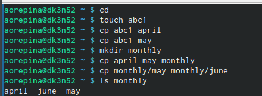
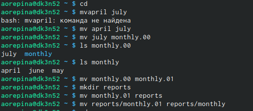
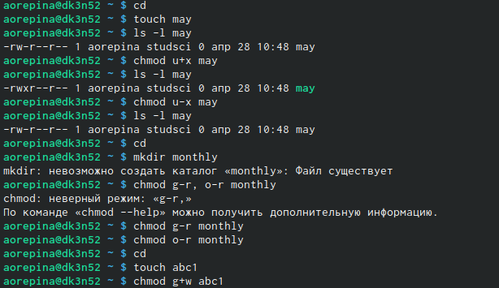
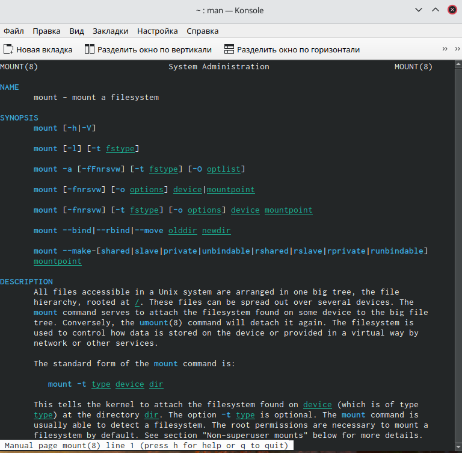
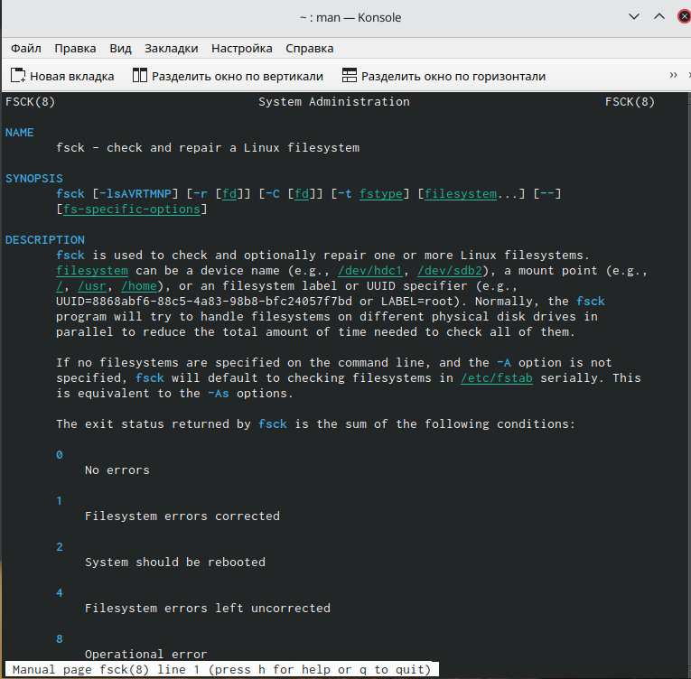

---
## Front matter
lang: ru-RU
title: Structural approach to the deep learning method
author: Репина Ангелина Олеговна
institute:  РУДН, Москва
date: NEC--2022, 28 Апреля, 2022 

## Formatting
toc: false
slide_level: 2
theme: metropolis
header-includes: 
 - '\makeatletter'
 - '\makeatother'
aspectratio: 43
section-titles: true
---

# Отчет по лабораторной работе 5

# Копирование файлов и каталогов

Копирование файла в текущем каталоге. Скопировав файл ~/abc1 в файл april и в файл may: создаем файл abc1, копируем.
Копирование нескольких файлов в каталог. Скопировала файлы april may в каталог monthly. (рис. 1)

{ #fig:01 width=70% }

# Перемещение и переименование файлов и каталогов

 Переименование файлов в текущем каталоге. Изменила название файла april на july в домашнем каталоге. Перемещение файлов в другой каталог (переместила файл july в каталог monthly.00) (рис.2)
 
{ #fig:01 width=70% }

#  Измена прав доступа

Создала файл may с правом выполнения для владельца, лишила владельца права на выполнение (рис. 3)

{ #fig:01 width=70% }

 
# Работа с командами man 

Команда mount предназначена для монтирования файловой системы. Все файлы, доступные в Unix системах, составляют иерархическую файловую структуру, которая имеет ветки и листья. Корень этого дерева обозначается как слеш. Физически файлы могут распологаться на различных устройствах. Команда mount служит для подключения файловых систем разных устройств к этому большому дереву.(рис.4)

 { #fig:01 width=70% }
 

# Работа с командами man 

Команда fsck: это утилита командной строки, которая позволяет выполнять проверки согласованности и интерактивное исправление в одной или нескольких файловых системах. Он используется программы, специфичные для типа файловой системы, которую он проверяет. У этой команды следующий синтаксис fsck [параметр]-[парамет ФС][…]. (рис.5)

 { #fig:01 width=70% }

# Выводы 

В ходе выполнения данной лабораторной работы я ознакомилась с файловой системой Linux её структурой и именами и содержанием каталогова, получила навыки по применению команд для работы с файлами и каталогами, по управлению провессами, по проверке испольщзования диска и обслуживанию файловой системы.
