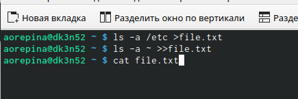
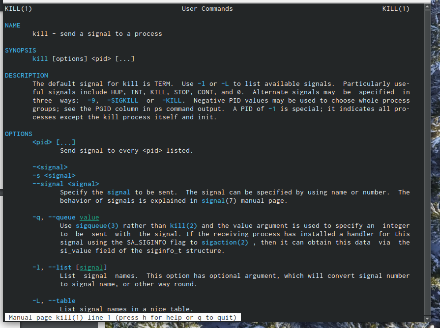
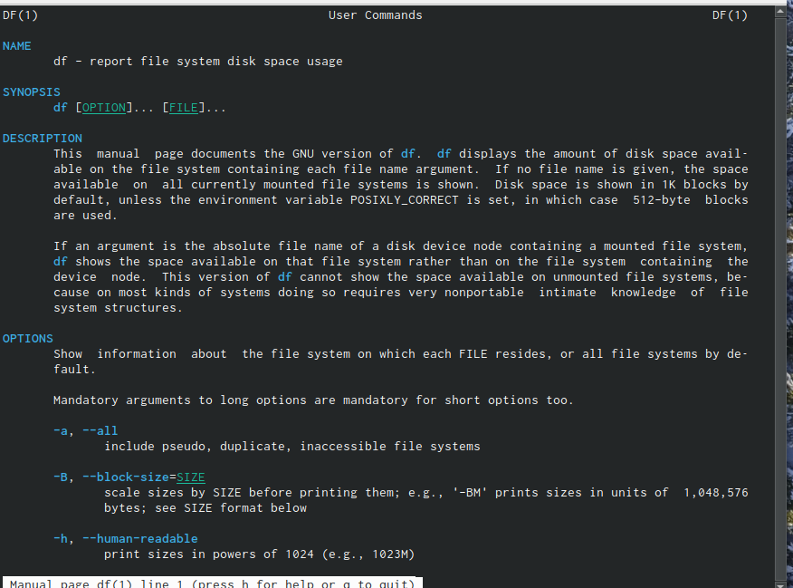
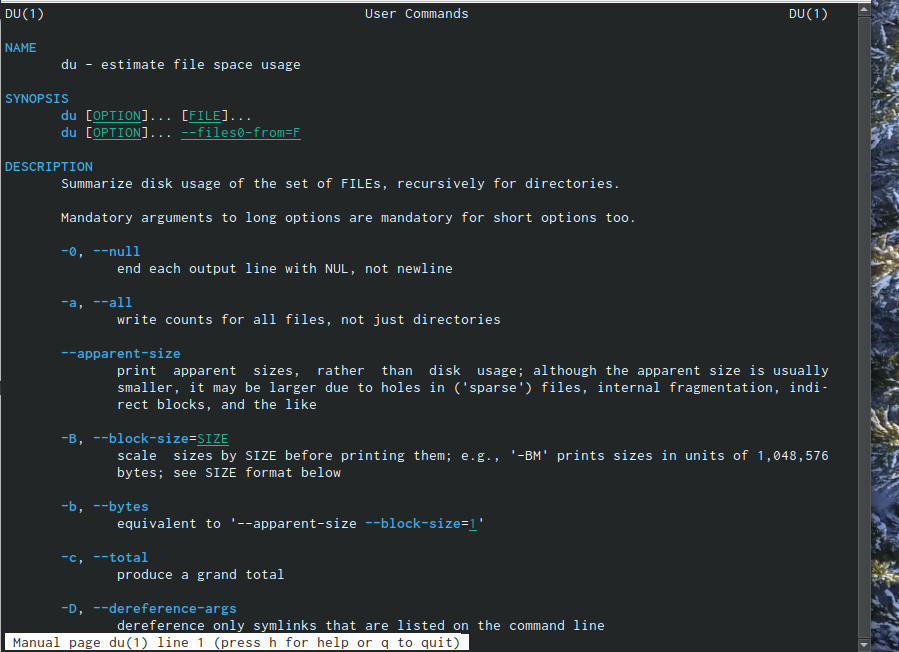

---
## Front matter
lang: ru-RU
title: Лабораторная работа 6
author: Репина Ангелина Олеговна
	
institute: RUDN University, Moscow, Russian Federation

## Formatting
toc: false
slide_level: 2
theme: metropolis
header-includes: 
 - \metroset{progressbar=frametitle,sectionpage=progressbar,numbering=fraction}
 - '\makeatletter'
 - '\beamer@ignorenonframefalse'
 - '\makeatother'
aspectratio: 43
section-titles: true
---

# Цель работы

-Поиск и фильтрация файлов
-Обслуживание файловых систем

# Запись в файл

Записала в файл file.txt названия файлов, содержащихся в каталоге /etc. Дописала в этот же файл названия файлов, содержащихся в моем домашнем каталоге 

{ #fig:01 width=70% }

# Редактор Gedit

Запустила из консоли в фоновом режиме редактор gedit. 

{ #fig:01 width=70% }

# Работа с командой gedit

Определила идентификатор процесса gedit, используя команду ps, конвейер и фильтр grep.

# Команда kill

Прочитала справку (man) команды kill, после чего использовала её для завершения процесса gedit. 

{ #fig:01 width=70% }

# Команды df, du

Выполнила команды df и du, предварительно получив более подробную информацию об этих командах, с помощью команды man. 

{ #fig:01 width=70% }
{ #fig:01 width=70% }

# Выводы

В ходе данной лабораторной работы я изучила инструменты поиска файлов и текствоых данных а также приобрела практические навыки по управлению процессами по проверке диска и обслуживанию файловых систем

