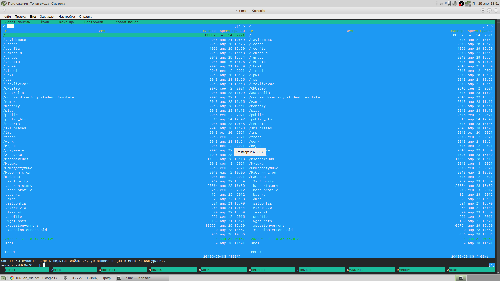
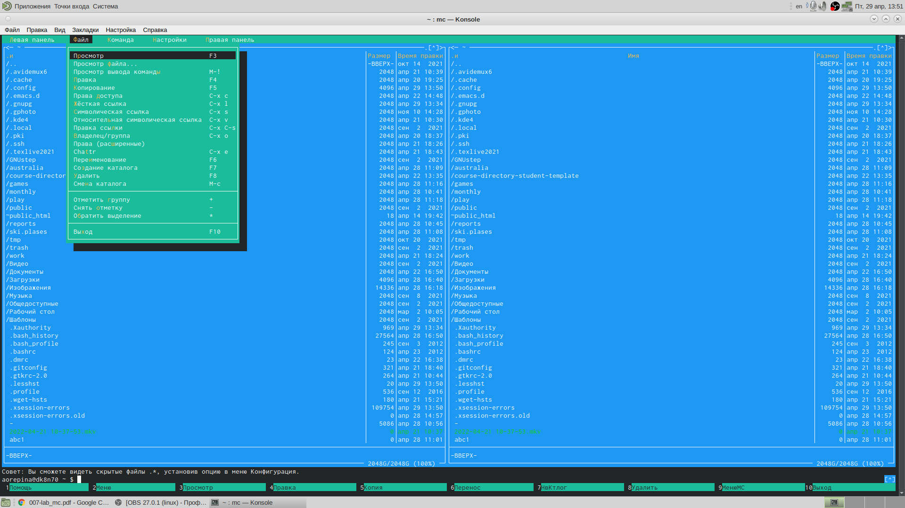
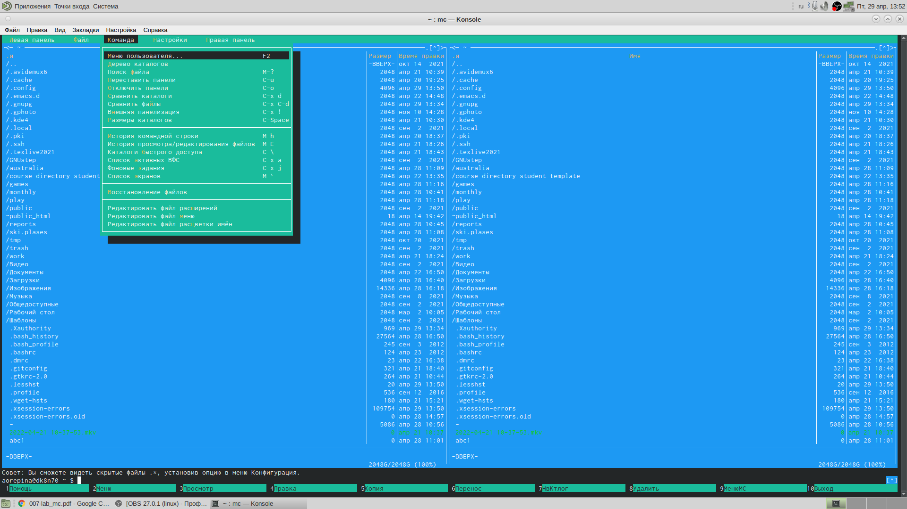
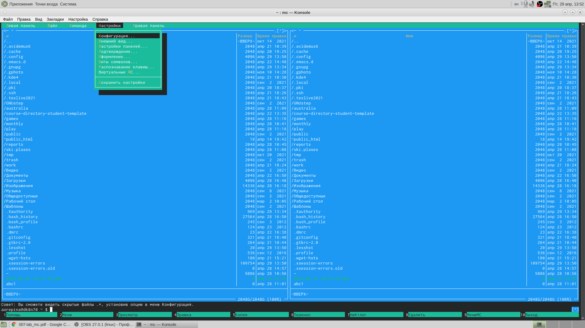
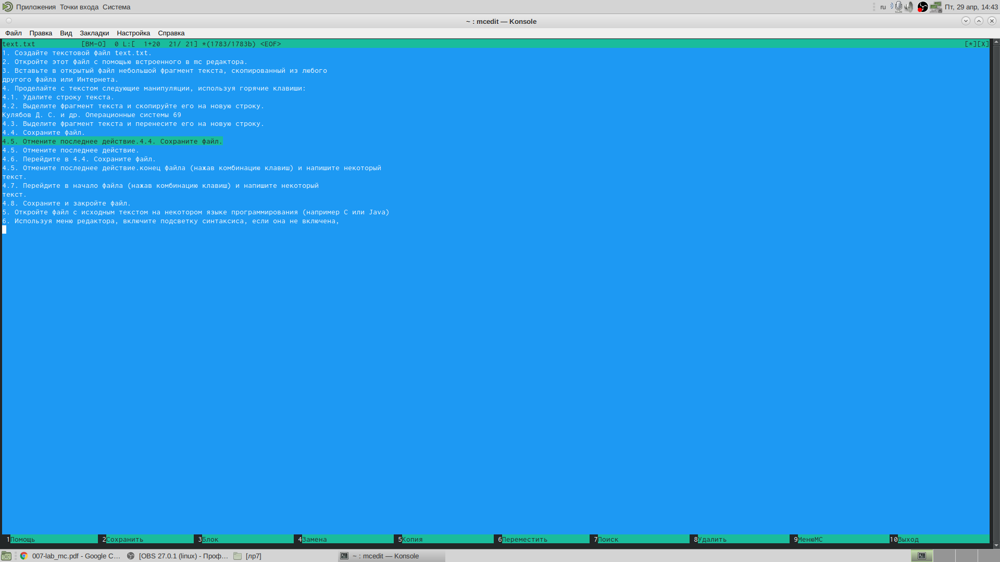

---
## Front matter
lang: ru-RU
title: Лабораторная работа 7
author:  Репина Ангелина Олеговна
	Imrikh Pokorny\inst{4}
institute: RUDN University, Moscow, Russian Federation

## Formatting
toc: false
slide_level: 2
theme: metropolis
header-includes: 
 - \metroset{progressbar=frametitle,sectionpage=progressbar,numbering=fraction}
 - '\makeatletter'
 - '\beamer@ignorenonframefalse'
 - '\makeatother'
aspectratio: 43
section-titles: true
---

# Отчет по лабораторной работе 7

# Цель работы

 Цель данной лабораторной работы - Освоить основных возможностей командной оболочки Midnight Commander. Приобрести навыков практической работы по просмотру каталогов и файлов; манипуляций с ними.

#  Midnight Commander

 Midnight Commander - это программа, предназначенная для просмотра содержимого каталогов и выполнения основных функций управления файлами в UNIX-подобных операционных системах

# Внешний вид и меню

Интерфейс mc содержит верхнее и нижнее меню. Верхнее меню предназначено для работы с каталогами и файлами, нижнее - это управляющие экранные кнопки, ассоциированные с функциональными клавишами F1-F10.

{ #fig:001 width=70% }

# Подменю "Файл"

С помощью подменю файл мы редактировали, просматривали файлы, создавали и копировали каталоги.

{ #fig:001 width=70% }

# Подменю "Команда"

 Подменю "Команда" позволяло нам осуществлять поиск файлов, повтор команд и переход в домашний каталог
 
 { #fig:001 width=70% }

# Подменю "Настройки"

 Благодаря подменю "Настройки" можно настраивать внешний вид mc для своего удобства
 
 { #fig:001 width=70% }

# Редактор mc

 Встроенный редактор mc позволяет из командной строки перейти к редактированию и просмотру файлов
 
 { #fig:001 width=70% }

# Выводы

В ходе выполнения данной лабораторной работы я освоила основные возможности командной оболочки Midnigh tCommander и приобрела навыки практической работы по просмотру каталогов и файлов; манипуляций с ними.

 
