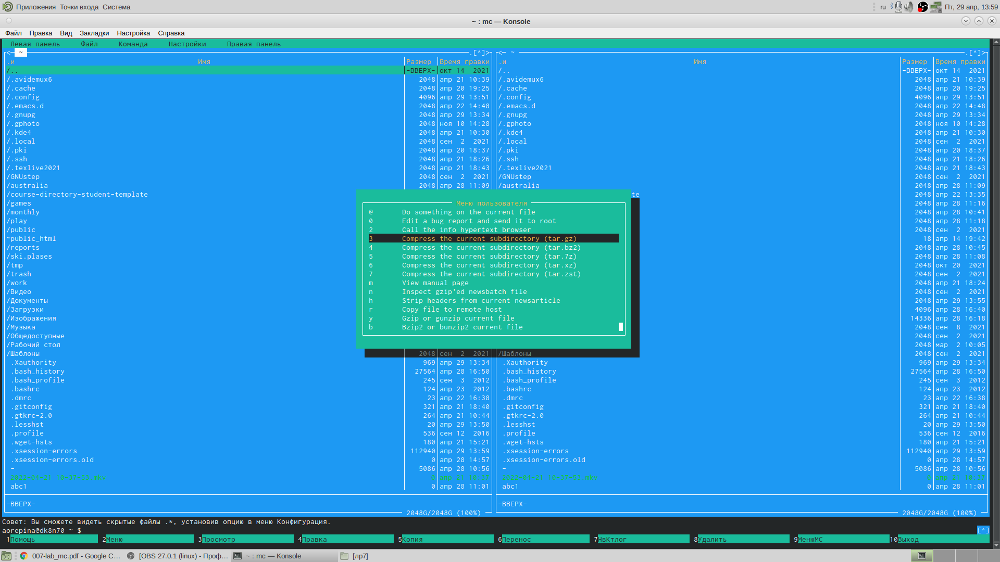

---
## Front matter
title: "Лабораторная работа 7"
subtitle: "Отчёт по лабораторной работе 7"
author: "Репина Ангелина Олеговна"

## Generic otions
lang: ru-RU
toc-title: "Отчет по лабораторной работе 7"

## Bibliography
bibliography: bib/cite.bib
csl: pandoc/csl/gost-r-7-0-5-2008-numeric.csl

## Pdf output format
toc-depth: 2
lof: true # List of figures
fontsize: 12pt
linestretch: 1.5
papersize: a4
documentclass: scrreprt
## I18n polyglossia
polyglossia-lang:
  name: russian
  options:
	- spelling=modern
	- babelshorthands=true
polyglossia-otherlangs:
  name: english
## I18n babel
babel-lang: russian
babel-otherlangs: english
## Fonts
mainfont: PT Serif
romanfont: PT Serif
sansfont: PT Sans
monofont: PT Mono
mainfontoptions: Ligatures=TeX
romanfontoptions: Ligatures=TeX
sansfontoptions: Ligatures=TeX,Scale=MatchLowercase
monofontoptions: Scale=MatchLowercase,Scale=0.9
## Biblatex
biblatex: true
biblio-style: "gost-numeric"
biblatexoptions:
  - parentracker=true
  - backend=biber
  - hyperref=auto
  - language=auto
  - autolang=other*
  - citestyle=gost-numeric
## Pandoc-crossref LaTeX customization
figureTitle: "Рис."
## Misc options
indent: true
header-includes:
  - \usepackage{indentfirst}
  - \usepackage{float} # keep figures where there are in the text
  - \floatplacement{figure}{H} # keep figures where there are in the text
---

# Цель работы

 Цель данной лабораторной работы - Освоить основных возможностей командной оболочки Midnight Commander. Приобрести навыков практической работы по просмотру каталогов и файлов; манипуляций с ними.
 

# Выполнение лабораторной работы

1. Изучила информмацию о mc с помощью команды man mс. Узнали, что MC - это псевдографическая командная оболочка для систем. Для запуска нужно ввести в командной строке mc. (рис. 1, 2, 3)

{ #fig:001 width=70% }

{ #fig:001 width=70% }

{ #fig:001 width=70% }

2. Заупстила из командной строки mc, изучила его структуру и меню. В стандартном состоянии окно редактора редактора состоит из двух панелей. Верхнее меню содержит меню "Левая панель" (рис.5), "Файл" (рис. 4), "Правая панель" (рис 8), "Команда" (рис 7), "Настройки"(рис 6). Нажав F2 можно вызвать Меню пользователя (рис 9), а с помощью F1 можно открыть Помощь (рис 10).

{ #fig:001 width=70% }

{ #fig:001 width=70% }

{ #fig:001 width=70% }

{ #fig:001 width=70% }

{ #fig:001 width=70% }

{ #fig:001 width=70% }

{ #fig:001 width=70% }

3. Выполнила операци в mc с помощью упарвляющих клавиш

3.1 Выделение\отмена выделения файлов (клавиша insert) (рис 11)

{ #fig:001 width=70% }

3.2 Для выделенияч файлов или его отмены можно использовать команды Отменить группу, Снять отметку, Обратить выделение в меню Файл (рис 12)

{ #fig:001 width=70% }

3.3 Копирование\перемещение файлов. Для копирования фойла испорльзуется клавиша F5 (рис 13), F6 используется для перемещения (рис 14)

{ #fig:001 width=70% }

{ #fig:001 width=70% }

3.4 Получение инфорации о размере и правах на файлы и каталоги. Для получения данной информации можно перейти в команды Левая панель, Информация (рис 15).

Ленвая панель, Формат списка, Расширенный (рис 16, 17)

{ #fig:001 width=70% }

{ #fig:001 width=70% }

{ #fig:001 width=70% }

Файл, Права доступа (рис 18)

{ #fig:001 width=70% }

Файл, Права(расширенные) (рис 19)

{ #fig:001 width=70% }

4. Выполнила основные команды меню правой панели

4.1 Пункт Список файлов отображает размкер файла и время его правки (рис 20)

{ #fig:001 width=70% }

4.2 Пункт Быстрый просмотр нужен для предпросмотра содержания  файла

4.3 Пункт Информация отображает подробные данные о файле (рис 22)

{ #fig:001 width=70% }

4.4 Пункт Дерево необходим для просмотра дерева каталога (рис 23)

{ #fig:001 width=70% }

4.5 Пункт Формат списка Укороченный отображает только имя файла или каталога (рис 24)

{ #fig:001 width=70% }

4.6 Пункт Формат списка Расширенный отображает информацию о файлах подробную, но менее подробную, чем Информация

{ #fig:001 width=70% }

4.7 Пункт Формат списка Определенный пользователем предоставляет пользователю возможность самому изменять степень подробности информации

4.8 Пункт Выбор кодировки нужен для просмотра и смены кодировки (рис 26)

{ #fig:001 width=70% }

5. Используя возможности под меню Файл

5.1 Просмотр содержимого текстового файла. Выберем текстовый файл и перейдем в пнукт просмотр (рис 27)

{ #fig:001 width=70% }

5.2 Редактирование содержимого текстового файла с помощью пункта Правка

5.3 Создаем каталог с помощью пункта Создание каталога (рис 28)

{ #fig:001 width=70% }

5.4 Копи рование файлов в каталог с помощью клавиши insert, далее с помощью пункта Копирование копирую данные в созданный каталог (рис 29)

{ #fig:001 width=70% }

6. Поиск в файловой системе файла с заданными условиями с помощью пункта Поиск файла и введенных параметров, аналогично нашла файлы с шаблоном имени *cpp (рис 30)

{ #fig:001 width=70% }

6.1 Выбор и повторение одной из предыдущих команд. Перешла в пункт История командной строки и увидела, что внизу экрана появилась строка История, но на пустая, потому что командная строка не была использовала  (рис 31, 32)

{ #fig:001 width=70% }

{ #fig:001 width=70% }

6.2 Перешла в домашний каталог с помощью Дерева каталогов (рис 33, )

{ #fig:001 width=70% }

7. Вызвла меню Настройки, освоила операции, определяющие структуру

7.1 Конфигурация - позволяет скорректировать настройки работы пользователя с панелямии (рис 34)

{ #fig:001 width=70% }

7.2 Внешний вид - Настройки панелей - определяют элементы отображаемые при вызове командера (рис35, 36)

{ #fig:001 width=70% }

{ #fig:001 width=70% }
 
7.3 Подтверждение установить или убрать вывод окна с запросом подтверждения действий или операциях удаления и перезаписи файлов (рис 37)

{ #fig:001 width=70% }

7.4 Оформление - менять цветову. гамму визуальной оболочки

7.5 Биты символов - формат обработки и нформации локальным терминалом

{ #fig:001 width=70% }

7.6 Сохранила настройки

Задание 2

1. Создала файл text.txt (touch text.txt) (рис 39)

{ #fig:001 width=70% }

2. Открыла файл и вставила в него фрагмент текста

{ #fig:001 width=70% }

3.
3.1 Удалила строку текста F8

3.2 Выделила фрагмент текста F3 для начала выделения и его окончания, скопировала его на новую строку F5

3.3 Выделила фрагмент текста и перенесла его на нвую строку F6

3.4 Сохранила F2

3.5 Отменила последнее действие ctrl+u

{ #fig:001 width=70% }

3.6 Перешла в конец файла ctrl end и написала строку привет

{ #fig:001 width=70% }

3.7 Перешла в начало файла ctrl home и написала пока

{ #fig:001 width=70% }

3.8 сохранила файл и вышла из него

4. Открыла файл с текстом на языке програмирования С++ с помощью МС

{ #fig:001 width=70% }

5. Выключила подсветку синтакисса с помощью Команда Включить\выключить подсветку синтакисса

{ #fig:001 width=70% }

Ответы на контрольные вопросы:
    1) Панели могут дополнительно быть переведены в один из двух режимов: «Информация» или «Дерево». В режиме «Информация» на панель выводятся сведения о файле и текущей файловой системе, расположенных на активной панели. В режиме «Дерево» на одной из панелей выводится структура дерева каталогов.
    2) Как с помощью команд shell, так и с помощью меню (комбинаций клавиш) mc можно выполнить следующие операции с файлами:
    • копирование «F5» («cp имя_файла имя_каталога (в который копируем)») (Рисунок14)
    • перемещение/переименование «F6» («mv имя_файла имя_каталога (в который перемещаем)»)(Рисунок15)
    • создание каталога «F7» («mkdir имя_каталога»)(Рисунок38)
    • удаление «F8» («rm имя_файла»)
    • изменение прав доступа «ctrl+x» («chmod u+x имя_файла»)
    3) Перейти в строку меню панелей mc можно с помощью функциональной клавиши «F9». В строке меню имеются пять меню: «Леваяпанель», «Файл», «Команда», «Настройки» и «Праваяпанель».
Под пункт меню «Быстрый просмотр» позволяет выполнить быстрый просмотр содержимого панели.
Подпункт меню «Информация» позволяет посмотреть информацию о файле или каталоге. В меню каждой (левой или правой) панели можно выбрать «Формат списка»:
    • стандартный − выводит список файлов и каталогов с указанием размера и времени правки;
    • ускоренный − позволяет задать число столбцов, на которые разбивается панель при выводе списка имён файлов или каталогов без дополнительной информации;
    • расширенный − помимо названия файла или каталога выводит сведения о правах доступа, владельце, группе, размере, времени правки;
    • определённый пользователем − позволяет вывести те сведения о файле или каталоге, которые задаст сам пользователь.
Подпункт меню «Порядок сортировки» позволяет задать критерии сортировки при выводе списка файлов и каталогов: без сортировки, по имени, расширенный, время правки, время доступа, время изменения атрибута, размер, узел.
    4) Команды меню «Файл»:
    • Просмотр(«F3»)− позволяет посмотреть содержимое текущего (или выделенного) файла без возможности редактирования.
    • Просмотр вывода команды («М»+«!»)− функция запроса команды с параметрами (аргумент к текущему выбранному файлу).
    • Правка(«F4») − открывает текущий (или выделенный) файл для его редактирования.
    • Копирование(«F5»)− осуществляет копирование одного или нескольких файлов или каталогов в указанное пользователем во всплывающем окне место.
    • Права доступа («Ctrl-x»«c»)− позволяет указать (изменить) права доступа к одному или нескольким файлам или каталогам.
    • Жёсткая ссылка («Ctrl-x»«l»)− позволяет создать жёсткую ссылку к текущему(или выделенному) файлу.
    • Символическая ссылка («Ctrl-x»«s»)− позволяет создать символическую ссылку к текущему (или выделенному) файлу.
    • Владелец/группа («Ctrl-x»«o»)− позволяет задать (изменить) владельца и имя группы для одного или нескольких файлов или каталогов.
    • Права(расширенные)− позволяет изменить права доступа и владения для одного или нескольких файлов или каталогов.
    • Переименование («F6»)− позволяет переименовать (или переместить) один или несколько файлов или каталогов.
    • Создание каталога («F7») − позволяет создать каталог.
    • Удалить («F8») − позволяет удалить один или несколько файлов или каталогов.
    • Выход («F10») − завершает работу mc.
    5) Меню Команда
В меню Команда содержатся более общие команды для работы с mc.
Команды меню Команда:
    • Дерево каталогов − отображает структуру каталогов системы.
    • Поиск файла − выполняет поиск файлов по заданным параметрам.
    • Переставить панели − меняет местами левую и правую панели.
    • Сравнить каталоги («Ctrl-x»«d») − сравнивает содержимое двух каталогов.
    • Размеры каталогов − отображает размер и время изменения каталога (по умолчанию в mc размер каталога корректно не отображается).
    • История командной строки − выводит на экран список ранее выполненных в оболочке команд.
    • Каталоги быстрого доступа(Ctrl-»)− при вызове выполняется быстрая смена текущего каталога на один из заданного списка.
    • Восстановление файлов − позволяет восстановить файлы на файловых системах ext2 и ext3.
    • Редактировать файл расширений − позволяет задать с
Елизавета Пермякова, вчера в 20:21 помощью определённого синтаксиса действия при запуске файлов с определённым расширением (например, какое программное обеспечение запускать для открытия или редактирования файлов с расширением doc или docx).
    • Редактировать файл меню − позволяет отредактировать контекстное меню пользователя, вызываемое по клавише «F2».
    • Редактировать файл расцветки имён − позволяет подобрать оптимальную для пользователя расцветку имён файлов в зависимости от их типа.
    6) Меню Настройки содержит ряд дополнительных опций по внешнему виду и функциональности mc.
Меню Настройки содержит:
    • Конфигурация − позволяет скорректировать настройки работы с панелями.
    • Внешний вид и Настройки панелей − определяет элементы (строка меню, командная строка, подсказки и прочее), отображаемые при вызове mc, а также геометрию расположения панелей и цветовыделение.
    • Биты символов − задаёт формат обработки информации локальным терминалом.
    • Подтверждение − позволяет установить или убрать вывод окна с запросом подтверждения действий при операциях удаления и перезаписи файлов, а также при выходе из программы.
    • Распознание клавиш − диалоговое окно используется для тестирования функциональных клавиш, клавиш управления курсором и прочее.
    • Виртуальные ФС − настройки виртуальной файловой системы: тайм-аут, пароль и прочее.
    7) Функциональные клавиши mc:
    • F1 – вызов контекстно-зависимой подсказки
    • F2 – вызов пользовательского меню с возможностью создания и/или дополнения дополнительных функций
    • F3 – просмотр содержимого файла, на который указывает подсветка в активной панели (без возможности редактирования)
    • F4 – вызов встроенного в mc редактора для изменения содержания файла, на который указывает подсветка в активной панели
    • F5 – копирование одного или нескольких файлов, отмеченных впервой (активной) панели, в каталог, отображаемый на второй панели
    • F6 – перенос одного или нескольких файлов, отмеченных в первой (активной) панели, в каталог, отображаемый на второй панели
    • F7 – создание подкаталога в каталоге, отображаемом в активной панели
    • F8 – удаление одного или нескольких файлов (каталогов), отмеченных в первой (активной) панели файлов
    • F9 – вызов меню mc
    • F10 – выход из mc
    8) Встроенный в mc редактор вызывается с помощью функциональной клавиши «F4». В нём удобно использовать различные комбинации клавиш при редактировании содержимого (как правило текстового) файла. Клавиши для редактирования файла:
    • «Ctrl-y» − удалить строку
    • «Ctrl-u» − отмена последней операции
    • «ins» - вставка/замена
    • «F7» − поиск (можно использовать регулярные выражения)
    • «↑-F7» − повтор последней операции поиска
    • «F4» − замена
    • «F3» − первое нажатие − начало выделения, второе − окончание выделения
    • «F5» − копировать выделенный фрагмент
    • «F6» − переместить выделенный фрагмент
    • «F8» − удалить выделенный фрагмент
    • «F2» − записать изменения в файл
    • «F10» − выйти из редактор
    9) Для редактирования меню пользователя, которое вызывается клавишей «F2», необходимо перейти в пункт «Редактировать файл меню» → «Команда» и изменить настройки файла.
    10) Часть команд «Меню пользователя», а также меню «Файл» позволяют выполнять действия, определяемые пользователем, над текущим файлом. Например, копирование каталога или файла, переименование, перемещение, архивирование.

# Выводы

В ходе выполнения данной лабораторной работы я освоила основные возможности командной оболочки Midnigh tCommander и приобрела навыки практической работы по просмотру каталогов и файлов; манипуляций с ними.

