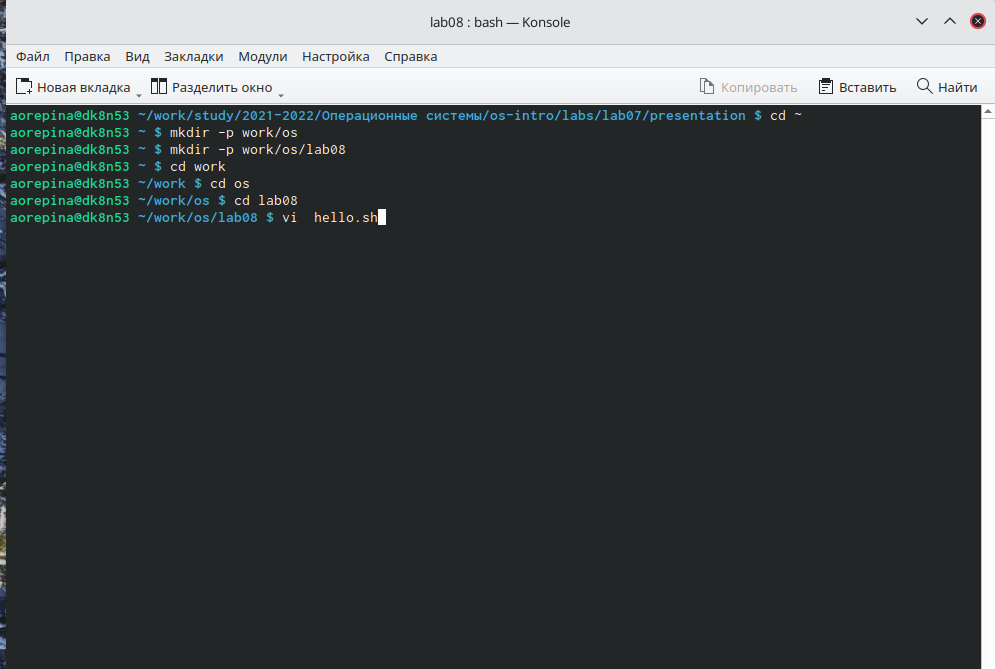
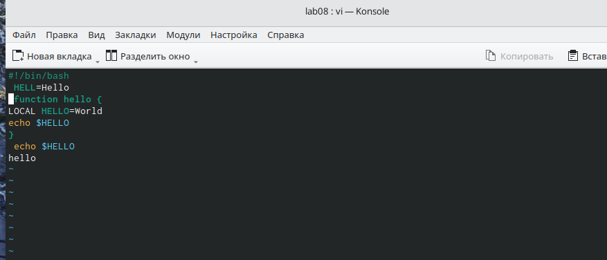
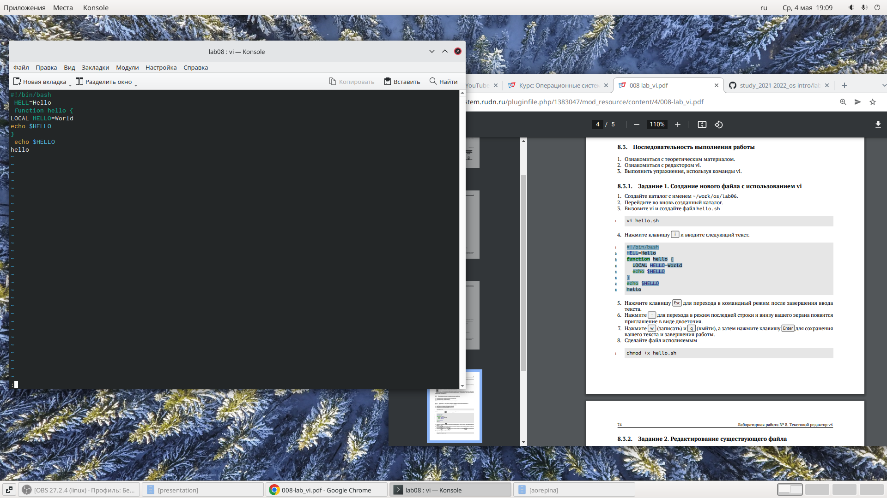
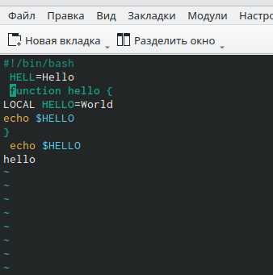
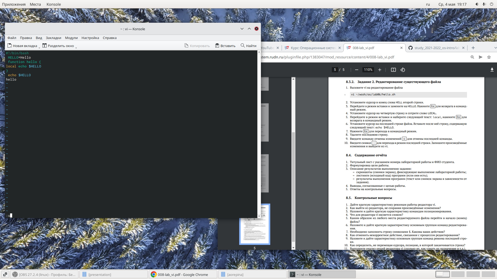

---
## Front matter
lang: ru-RU
title: Лабораторная работа 8
author: Репина Ангелина Олегона
institute: RUDN University, Moscow, Russian Federation
	 

## Formatting
toc: false
slide_level: 2
theme: metropolis
header-includes: 
 - \metroset{progressbar=frametitle,sectionpage=progressbar,numbering=fraction}
 - '\makeatletter'
 - '\beamer@ignorenonframefalse'
 - '\makeatother'
aspectratio: 43
section-titles: true
---

# Отчет по лабораторной работе 8

#  Создание каталога

Создала каталог с именем ~/work/os/lab06 (команда mkdir)

{ #fig:01 width=70% }

# Работа с текстом в редакторе

Нажимаем клавишу i и вводим тектс, указанный в лабораторной работе

{ #fig:01 width=70% } 

 
# Работа с текстом в редакторе

Нажимаю : для перехода в режим последней строки, появилось приглашение двоеточия.

 { #fig:01 width=70% }

# Работа с текстом в редакторе

Прешла в режим вставки, дописала HELLO

{ #fig:01 width=70% }

 

# Работа с текстом в редакторе

 Удалила последнюю строку, потом восстановила её с помощью горячих клавиш
 
 { #fig:01 width=70% }
 
 

# Выводы 

В ходе данной лабораторной работы я познакомилась с операционной системой Linux и получила практические навыки работы с редактором vi, установленным по умолчанию практически во всех дистрибутивах

 
