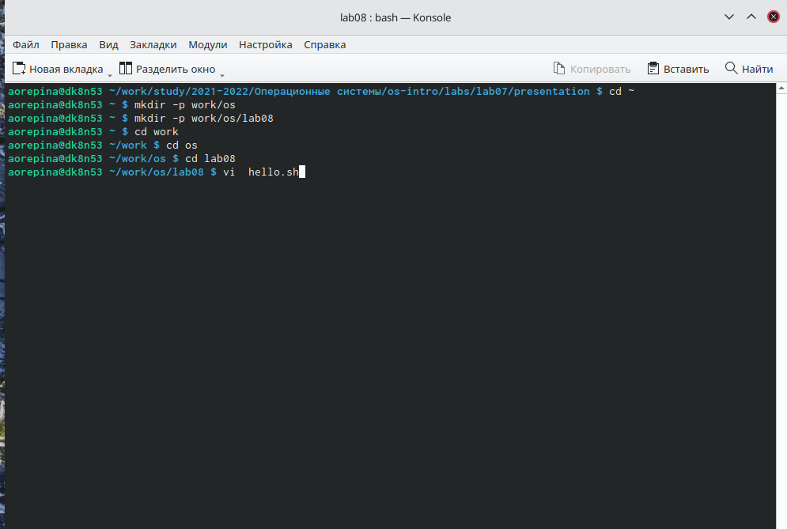
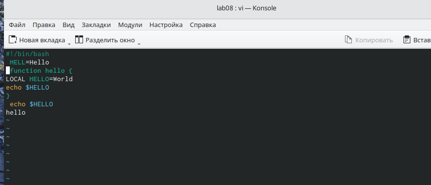
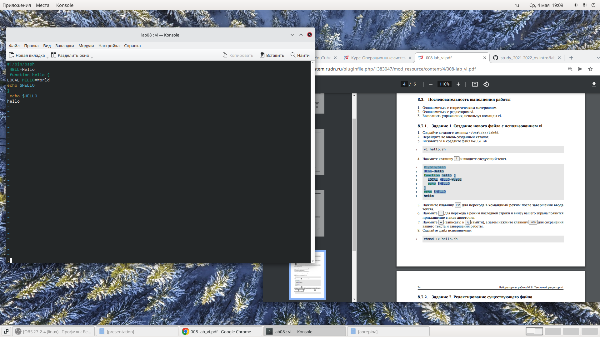
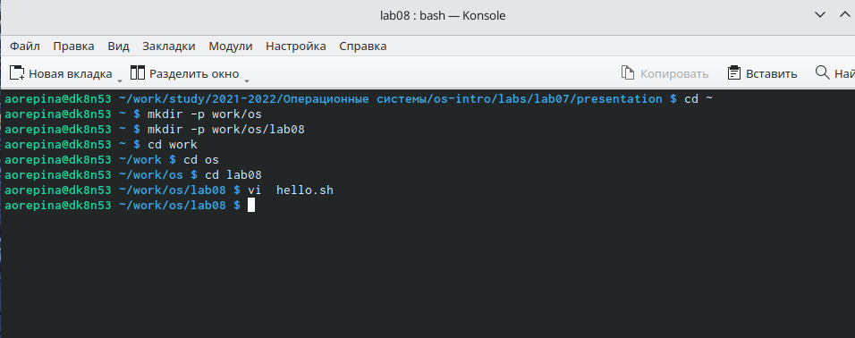
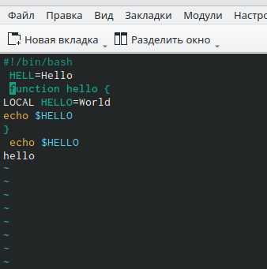
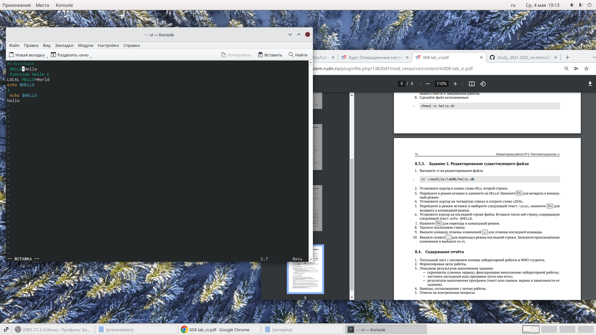
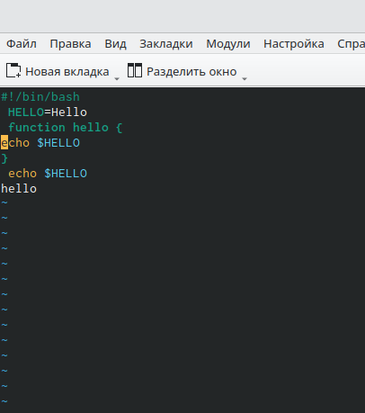
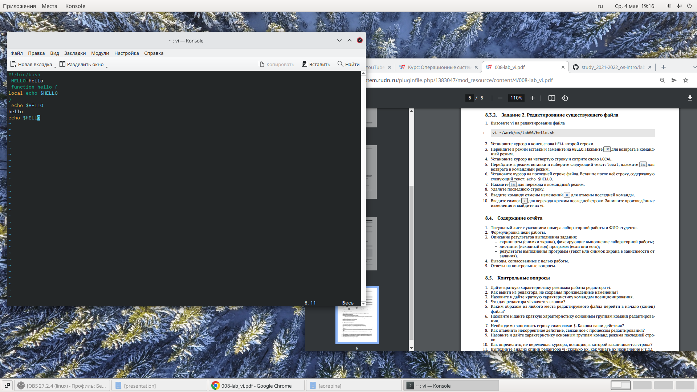
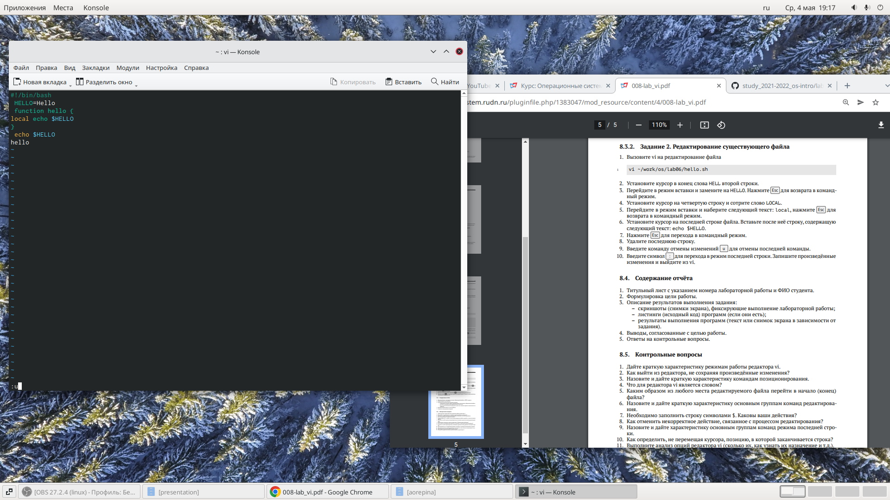
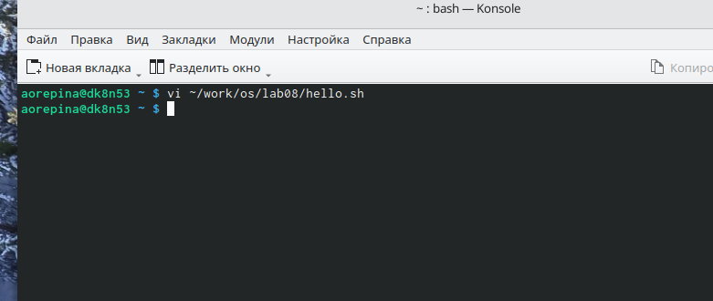

---
## Front matter
title: "Лабораторная работа 8"
subtitle: "Отчет по лабораторной работе 8"
author: "Репина Ангелина Олеговна"

## Generic otions
lang: ru-RU
toc-title: "Содержание"

## Bibliography
bibliography: bib/cite.bib
csl: pandoc/csl/gost-r-7-0-5-2008-numeric.csl

## Pdf output format
toc-depth: 2
lof: true # List of figures
fontsize: 12pt
linestretch: 1.5
papersize: a4
documentclass: scrreprt
## I18n polyglossia
polyglossia-lang:
  name: russian
  options:
	- spelling=modern
	- babelshorthands=true
polyglossia-otherlangs:
  name: english
## I18n babel
babel-lang: russian
babel-otherlangs: english
## Fonts
mainfont: PT Serif
romanfont: PT Serif
sansfont: PT Sans
monofont: PT Mono
mainfontoptions: Ligatures=TeX
romanfontoptions: Ligatures=TeX
sansfontoptions: Ligatures=TeX,Scale=MatchLowercase
monofontoptions: Scale=MatchLowercase,Scale=0.9
## Biblatex
biblatex: true
biblio-style: "gost-numeric"
biblatexoptions:
  - parentracker=true
  - backend=biber
  - hyperref=auto
  - language=auto
  - autolang=other*
  - citestyle=gost-numeric
## Pandoc-crossref LaTeX customization
figureTitle: "Рис."
## Misc options
indent: true
header-includes:
  - \usepackage{indentfirst}
  - \usepackage{float} # keep figures where there are in the text
  - \floatplacement{figure}{H} # keep figures where there are in the text
---

# Цель работы

Цель данной лабораторной работы - познакомиться с операционной системой Linux. Получить практические навыки работы с редактором vi, установленным по умолчанию рпактически во всех дистрибутивах.

 

# Выполнение лабораторной работы

1. Выполняю задание 1
1) создала каталог с именем ~/work/os/lab06. (рис 1)

2) перешла в созданный каталог командой cd (рис 1)

3) вызвала  vi и создала файл hello.sh с помощью команды vi hello.sh (рис 1)

{ #fig:01 width=70% }

4) С помощью клавищи i открываем вставку и вводим указанный текст (рис 2)

{ #fig:01 width=70% }

5) С помощью клавиши Esc перехожу в командный режим после завершения ввода текста

6) Нажимаю : для перехода в режим последней строки и внизу моего экрана появляется приглашение в виде двоеточия. Нажимаю w (записать) и q (выйти), затем Enter для сохранения моего текста и завершения работы (рис 3)

{ #fig:01 width=70% }

7) Делаю мой файл исполняемым с помощью команды chmod +x hello.sh

2. Выполняю задание 2

1) Вызвала vi для редактирования файла (команда vi ~/work/os/lab06/hello.sh) (рис 4)

{ #fig:01 width=70% }

2) Устанавливаю курсор в конец слова HELL второй строки с помощью горячих клавиш (рис 5)

{ #fig:01 width=70% }

3) Перехожу в режим вставки (i) и заменила на HELLO, нажимаю Esc для возврата в командныйц режим (рис 6)

{ #fig:01 width=70% }

4) Устанавливаю курсор на четвертую строку и стираю слово LOCAL (рис 7)

{ #fig:01 width=70% }

5) Перехожу в режим вставки и набираю следующий текст: local, нажимаю ESC для возврата в командный режим (рис 8)

{ #fig:01 width=70% }

6) Устанавливаю урсор на последнюю строку файла и вставляю после неё строку, содержащую текст из лабораторной работы (рис 9)

{ #fig:01 width=70% }

7) Удаляю последнюю строку (рис 10)

{ #fig:01 width=70% }

8) Ввожу команду u для отмены изменений последних (рис 11)

{ #fig:01 width=70% }

9) Ввожу двоеточие для перехода в режим последней строки, записываю произведенные изменения (w) и выхожу из vi (q)

{ #fig:01 width=70% }

# Выводы

В ходе данной лабораторной работы я познакомилась с операционной системой Linux и получила практические навыки работы с редактором vi, установленным по умолчанию практически во всех дистрибутивах

 

::: {#refs}
:::
