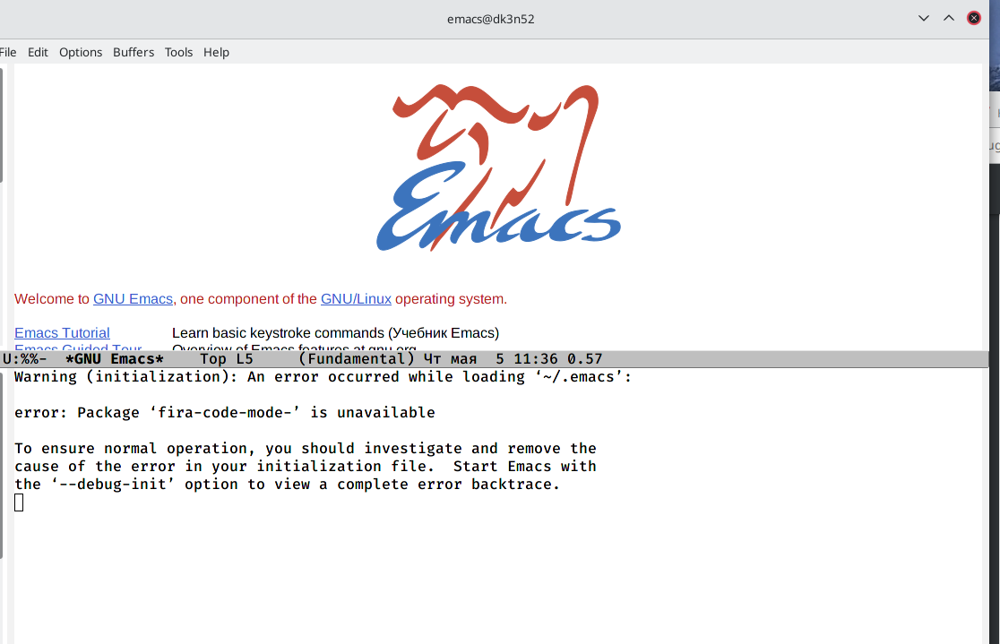
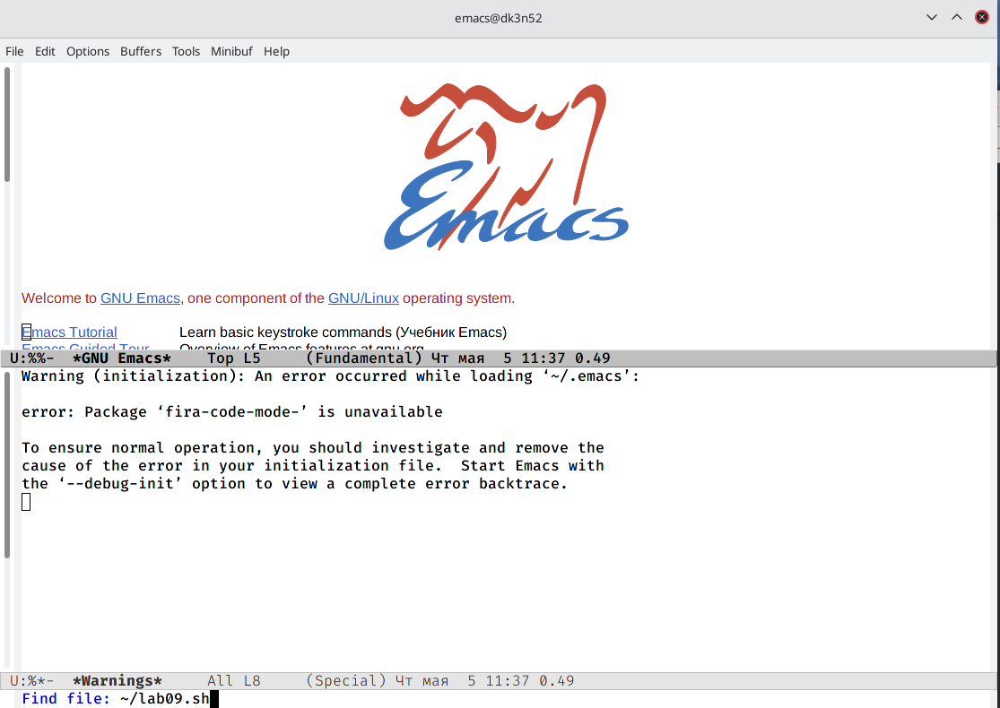
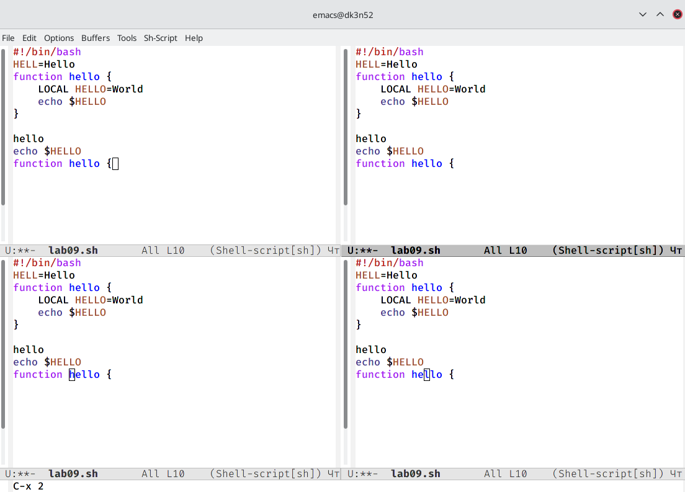
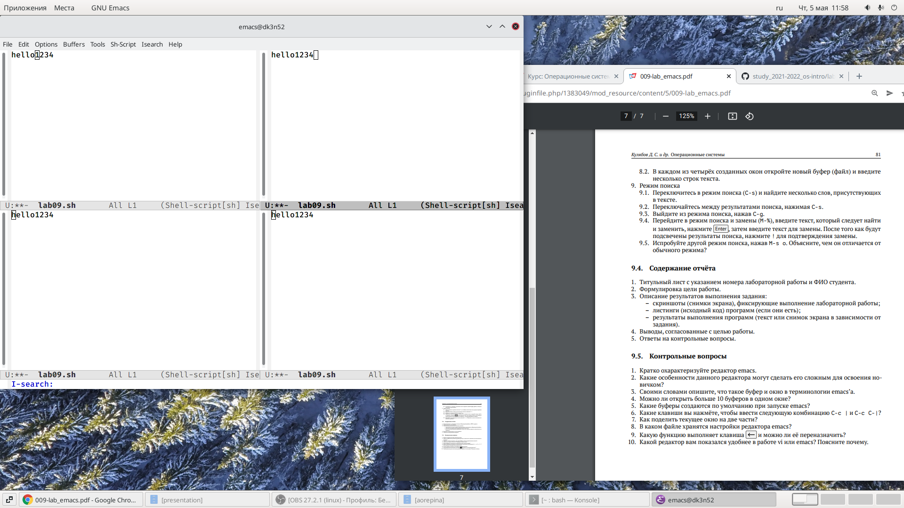
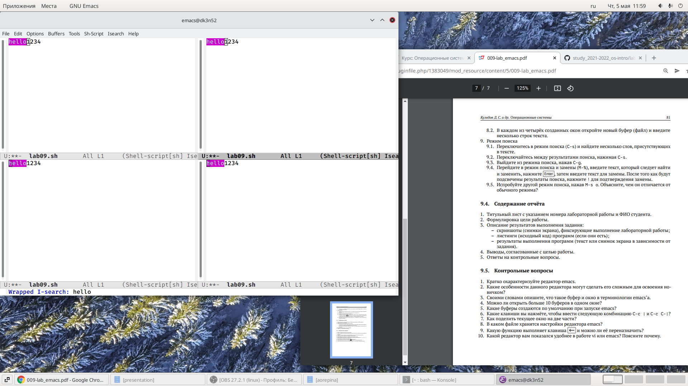

---
## Front matter
lang: ru-RU
title: Лабораторная работа 9
author:  Репина Ангелина Олеговна
institute: RUDN University, Moscow, Russian Federation
	 

## Formatting
toc: false
slide_level: 2
theme: metropolis
header-includes: 
 - \metroset{progressbar=frametitle,sectionpage=progressbar,numbering=fraction}
 - '\makeatletter'
 - '\beamer@ignorenonframefalse'
 - '\makeatother'
aspectratio: 43
section-titles: true
---

# Редактор Emacs

Открыла редактор Emacs с помощью команды emacs &

{ #fig:01 width=70% }

# Редактор Emacs 

Создала файл lab09.sh c помощью комбинации Ctrl-x Ctrl-f

{ #fig:01 width=70% }
 

# Работа с фреймом

Поделила фрейм на 4 части (Ctrl-x 3)

{ #fig:01 width=70% }

 
# Режим поиска

Переключилась в режим поиска (Ctrl-s)

{ #fig:01 width=70% }

 
# Режим поиска

Переключилась между результатами поиска

{ #fig:01 width=70% }

 

# Выводы

В ходе выполнения данной лабораторной работы я познакомилась с операционной системой Linux и получила практические навыки работы с редактором Emacs

 
