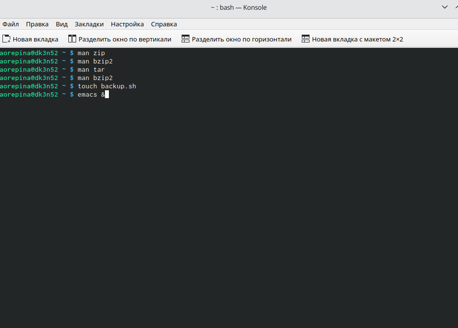
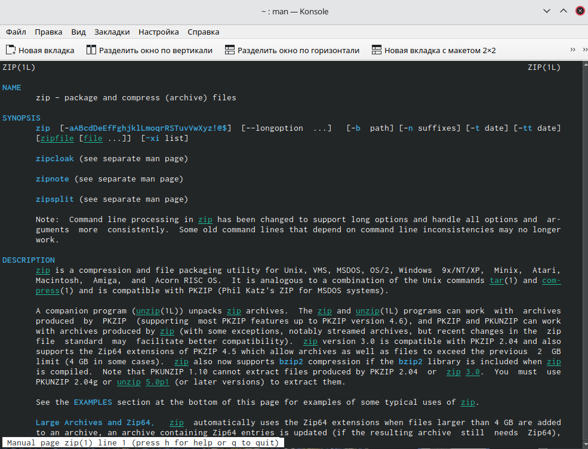
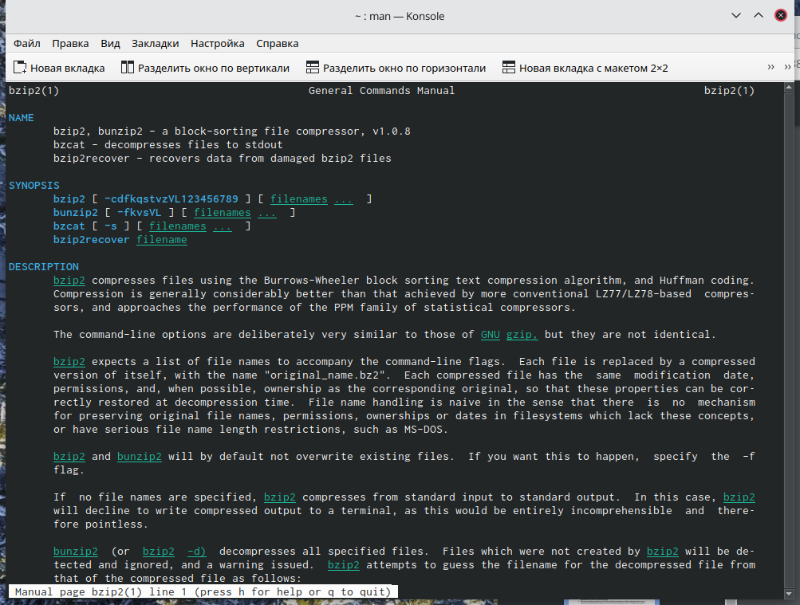
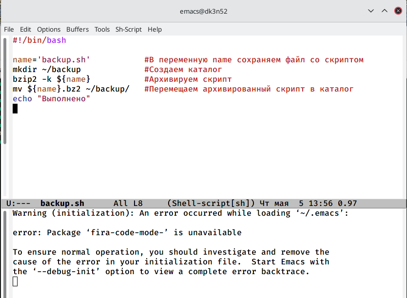
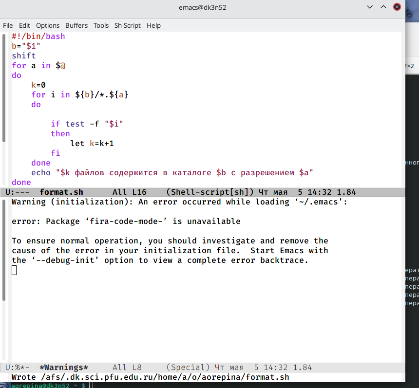

---
## Front matter
lang: ru-RU
title: Structural approach to the deep learning method
author:  Репина Ангелина Олеговна
institute: RUDN University, Moscow, Russian Federatioн

## Formatting
toc: false
slide_level: 2
theme: metropolis
header-includes: 
 - \metroset{progressbar=frametitle,sectionpage=progressbar,numbering=fraction}
 - '\makeatletter'
 - '\beamer@ignorenonframefalse'
 - '\makeatother'
aspectratio: 43
section-titles: true
---

# Отчет по лабораторной работе 10

# Работа с консолью

Для начала я изучила команды архивации с помощью команды man

{ #fig:01 width=70% }

# Aрхиватор zip

Синтаксис команды zip для архивации файла: zip [опции] [имя файла.zip] [файлы иил папки, которые будем архивировать] 
Cинтакиси команды zip для разархивации файла: unzip [опции] [файл архива.zip] [файлы] -x [исключить] -d [папка]

{ #fig:01 width=70% }

# Архиватор bzip2

Синтакисис bzip2 для архивации файла: bzip2 [опции][имена файлов]
Cинтаксис команды bzip2 для разархивации файла: bunzip2[опции][архивы.bz2] 

{ #fig:01 width=70% }

# Скрипт 1

Скрип, при запуске делающий копию самого себя

{ #fig:01 width=70% }

 
# Скрипт 4

Написала командный файл, получающий в качестве аргумента командной строки формат файла

{ #fig:01 width=70% }
 
# Выводы

В ходе выполнения данной лабораторной работы я изучила основы программирования в оболочке Linux и получила практические навыки по написанию небольших командных файлов

  
