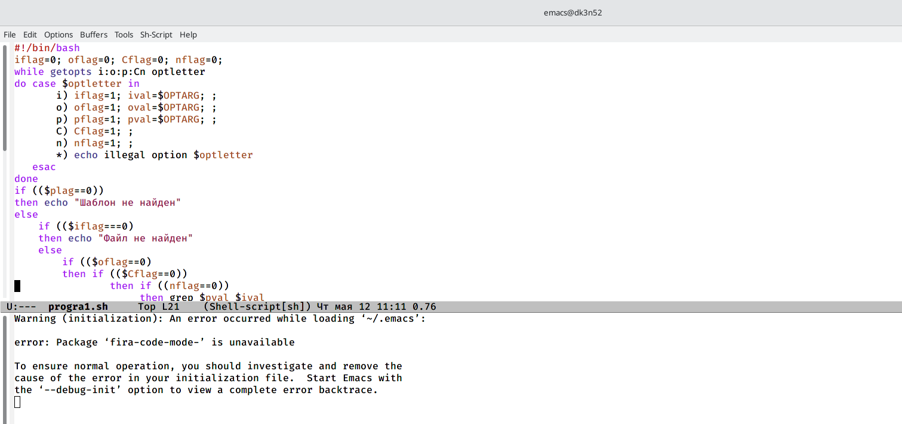
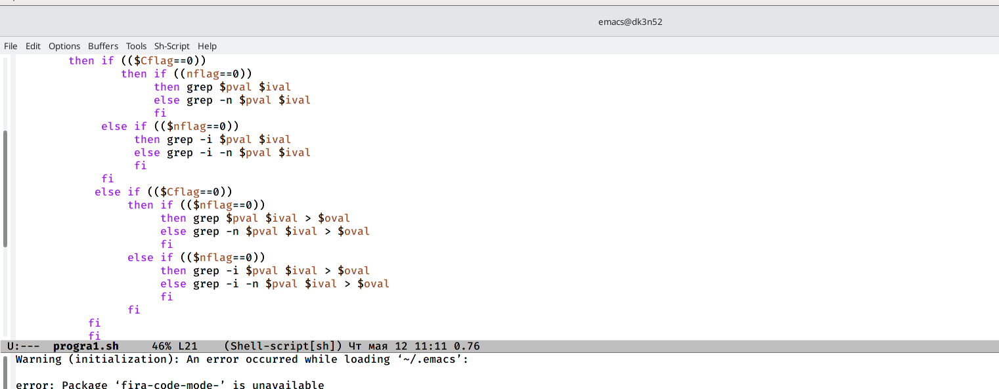
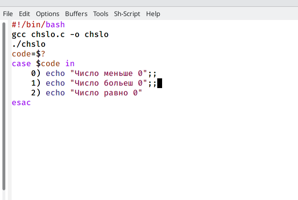
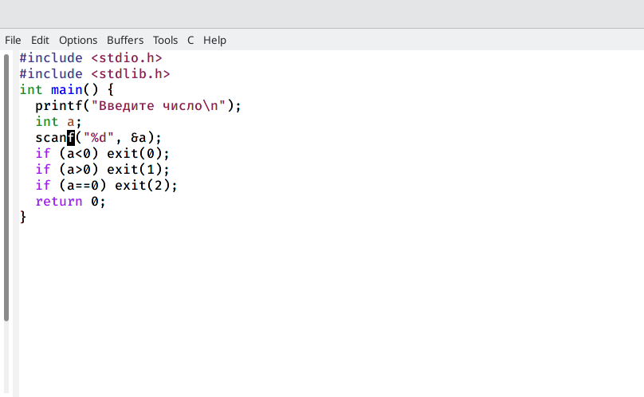
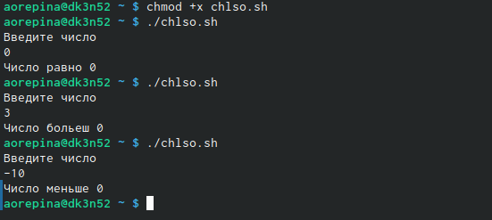
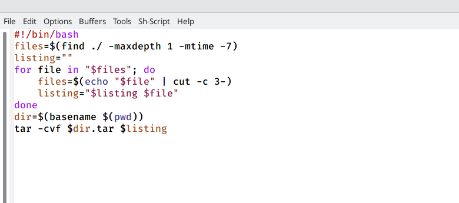

---
## Front matter
lang: ru-RU
title: Лабораторная работа 11
author: Репина Ангелина Олеговна
	
institute: University, Moscow, Russian Federation
	

## Formatting
toc: false
slide_level: 2
theme: metropolis
header-includes: 
 - \metroset{progressbar=frametitle,sectionpage=progressbar,numbering=fraction}
 - '\makeatletter'
 - '\beamer@ignorenonframefalse'
 - '\makeatother'
aspectratio: 43
section-titles: true
---

# Отчет по лабораторной работе 11

# Команды getopts grep

Используя команды getopts grep, написала командный файл, который анализирует командную строку с ключами:
 – -iinputfile — прочитать данные из указанного файла; 
 – -ooutputfile — вывести данные в указанный файл; 
 – -pшаблон — указать шаблон для поиска; 
 – -C — различать большие и малые буквы;
  – -n — выдавать номера строк. а затем ищет в указанном файле нужные строки, определяемые ключом -p. 
  
  { #fig:01 width=70% }
  
  { #fig:01 width=70% }

 

# Cкрипт 1

 { #fig:01 width=70% }
  
 { #fig:01 width=70% }

# Программа на языке Си

Написала на языке Си программу, которая вводит число и определяет, является ли оно больше нуля, меньше нуля или равно нулю. Затем программа завершается с помощью функции exit(n), передавая информацию в о коде завершения в оболочку.
 

# Скрипт 2

 { #fig:01 width=70% }
 
 { #fig:01 width=70% }

# Проверка работы скрипта

{ #fig:01 width=70% }

 

# Скрипты для работы с командой tar

{ #fig:01 width=70% }

# Выводы

 В ходе выполнения лабораторной работы я изучила основы программирования в оболочке ОС UNIX и научилась писать небольшие командные файлы.

 
