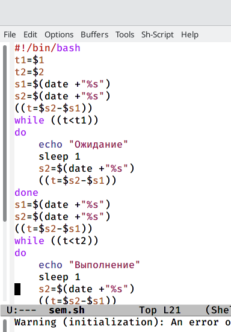
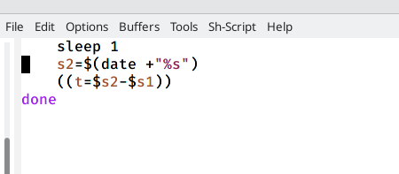
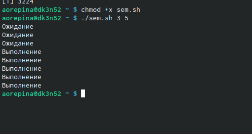
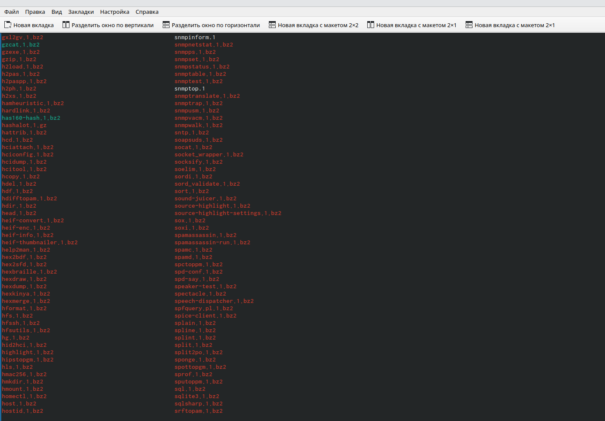
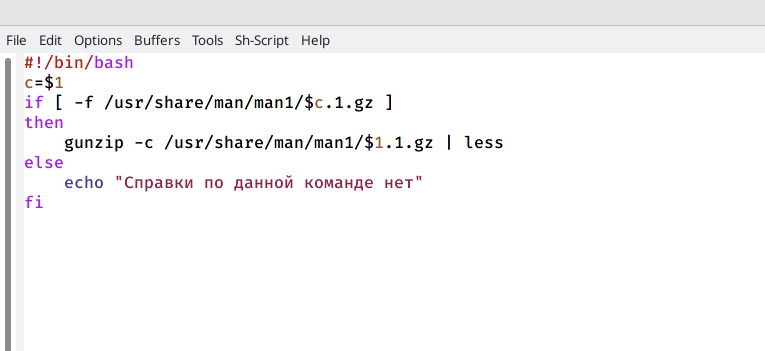
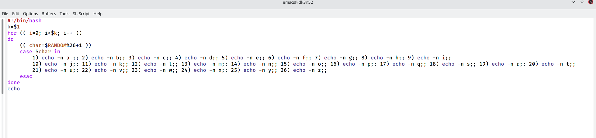

---
## Front matter
lang: ru-RU
title: Лабораторная работа 12
author: Репина Ангелина Олеговна
institute: RUDN University, Moscow, Russian Federation

## Formatting
toc: false
slide_level: 2
theme: metropolis
header-includes: 
 - \metroset{progressbar=frametitle,sectionpage=progressbar,numbering=fraction}
 - '\makeatletter'
 - '\beamer@ignorenonframefalse'
 - '\makeatother'
aspectratio: 43
section-titles: true
---

# Отчет по лабораторной работе 12

# Скрипт 1

 Написала команный файл, реализующий упрощенный механизм семафоров
 
{ #fig:01 width=70% }

{ #fig:01 width=70% }

# Проверка скрипта 1

Далее я проверила работу написанного скрипта

{ #fig:01 width=70% }

# Реализация команды man

Реализовала команду man с помощью командного файла

{ #fig:01 width=70% }

 
# Скрипт 2

Скрипт, открывающий архивы текстовых файлов, содержащих справку по большитнству установленных в системе программ и команд

{ #fig:01 width=70% }

# Скрипт 3

 \Используя встроенную переменную $RANDOM написала командный файл, генерирующий случайную последовательность букв 
 
{ #fig:01 width=70% }

## Универсальных специалистов больше не будет

 В ходе выполнения данной лабораторной работы я изучила основы программирования в оболочке ЮНИКС и научилась писать более сложные командные файлы с использованием логических управляющих и циклов.

 
