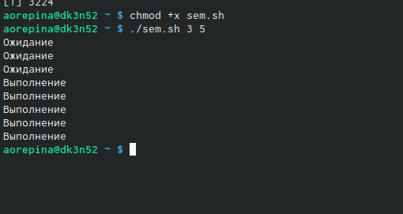
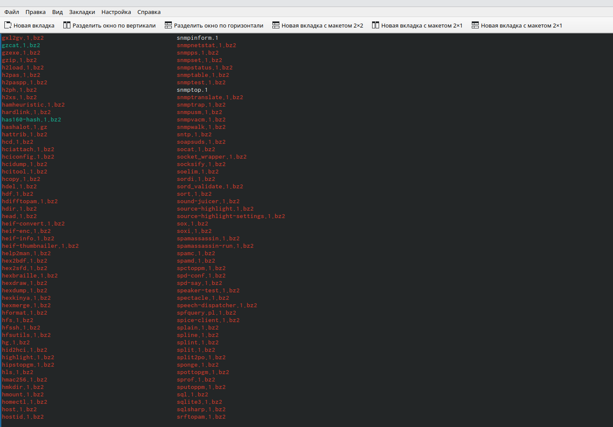

---
## Front matter
title: "Лабораторная работа 12"
subtitle: "Отчет по лабораторной работе 12"
author: "Репина Ангелина Олеговна"

## Generic otions
lang: ru-RU
toc-title: "Содержание"

## Bibliography
bibliography: bib/cite.bib
csl: pandoc/csl/gost-r-7-0-5-2008-numeric.csl

## Pdf output format
toc-depth: 2
lof: true # List of figures
fontsize: 12pt
linestretch: 1.5
papersize: a4
documentclass: scrreprt
## I18n polyglossia
polyglossia-lang:
  name: russian
  options:
	- spelling=modern
	- babelshorthands=true
polyglossia-otherlangs:
  name: english
## I18n babel
babel-lang: russian
babel-otherlangs: english
## Fonts
mainfont: PT Serif
romanfont: PT Serif
sansfont: PT Sans
monofont: PT Mono
mainfontoptions: Ligatures=TeX
romanfontoptions: Ligatures=TeX
sansfontoptions: Ligatures=TeX,Scale=MatchLowercase
monofontoptions: Scale=MatchLowercase,Scale=0.9
## Biblatex
biblatex: true
biblio-style: "gost-numeric"
biblatexoptions:
  - parentracker=true
  - backend=biber
  - hyperref=auto
  - language=auto
  - autolang=other*
  - citestyle=gost-numeric
## Pandoc-crossref LaTeX customization
figureTitle: "Рис."
## Misc options
indent: true
header-includes:
  - \usepackage{indentfirst}
  - \usepackage{float} # keep figures where there are in the text
  - \floatplacement{figure}{H} # keep figures where there are in the text
---

# Цель работы

Цель лабораторной работы - изучение основ программирования в оболочке OC UNIX и получение практических навыков по написанию более сложных командных файлов с сипользованием логических управляющих конструкций и циклов

# Выполнение лабораторной работы

1) Написала командный файл, реализующий упрощённый механизм семафоров. Командный файл должен в течение некоторого времени t1 дожидаться освобождения ресурса, выдавая об этом сообщение, а дождавшись его освобождения, использовать его в течение некоторого времени t2<>t1, также выдавая информацию о том, что ресурс используется соответствующим командным файлом (процессом).  Для данной задачи я создала файл sem.sh (рис 1)и написала соответствующий скрипт (рис 2, 3)
 
{ #fig:01 width=70% }

{ #fig:01 width=70% }

{ #fig:01 width=70% }

Далее я проверила работу написанного скрипта (./sem.sh 4 7), предварительно предоставив файлу право на исполнение (chmod +x sem.sh). (рис 4). Скрипт работает корректно

{ #fig:01 width=70% }

После этого я изменила скрипт так, чтобы его можно было выполнять в нескольких терминалахи прверила его работу ( например команда ./sem.sh 2 3 Ожидание > /dev/pts/1 &) (рис 5, 6, 7). После проверила работу скрипта и увидела, что мне было отказано в доступе (рис 8)

{ #fig:01 width=70% }

{ #fig:01 width=70% }

{ #fig:01 width=70% }

{ #fig:01 width=70% }

2) Реализовала команду man с помощью командного файла. Изучила содержимое каталога /usr/share/man/man1 (рис 9). В нем находятся архивы текстовых файлов, содержащих
справку по большинству установленных в системе программ и команд. Каждый архив
можно открыть командой less сразу же просмотрев содержимое справки. Командный
файл должен получать в виде аргумента командной строки название команды и в виде
результата выдавать справку об этой команде или сообщение об отсутствии справки,
если соответствующего файла нет в каталоге man1

{ #fig:01 width=70% }

Для данной задачи я создала файл man.sh (рис 10) и написала соответствующий скрипт (рис 11)

{ #fig:01 width=70% }

{ #fig:01 width=70% }

Далее я проверила работу написанного скрипта (./man.sh ls и ./man.sh mkdir) , предварительно добавив право на исполнение файла (chmod +x man.sh) (рис 12). Скрипт работает корректно

{ #fig:01 width=70% }

3) Используя встроенную переменную $RANDOM, написала командный файл, генерирующий случайную последовательность букв латинского алфавита. Учла, что $RANDOM выдаёт псевдослучайные числа в диапазоне от 0 до 32767. Для данной задачи я создала файл random.sh и написала соответствующий скрипт (рис 13, 14)

{ #fig:01 width=70% }

{ #fig:01 width=70% }

Далее я проверила работу написанного скрипта (./random.sh 7; 17), предварительно добавив право на исполднение файла (рис 15). Скрипт работает корректно

{ #fig:01 width=70% }

# Выводы

В ходе выполнения данной лабораторной работы я изучила основы программирования в оболочке UNIX и научилась писать более сложные командные файлы с использованием логических управляющих конструкций и циклов

# Итоговые вопросы

1). while [$1 != “exit”]
В данной строчке допущены следующие ошибки:
    • не хватает пробелов после первой скобки [и перед второй скобкой ]
    • выражение $1 необходимо взять в “”, потому что эта переменная может содержать пробелы.
Таким образом, правильный вариант должен выглядеть так: while [“$1”!= “exit”]
2). Чтобы объединить несколько строк в одну, можно воспользоваться несколькими способами:
    • Первый:
VAR1="Hello,
“VAR2=” World"
VAR3=“VAR2”
echo “$VAR3”
Результат: Hello, World
    • Второй:
VAR1=“Hello,”
VAR1+=" World"
echo “$VAR1”
Результат: Hello, World
3). Команда seq в Linux используется для генерации чисел от ПЕРВОГО до ПОСЛЕДНЕГО шага INCREMENT.
Параметры:
    • seq LAST: если задан только один аргумент, он создает числа от 1 до LAST с шагом шага, равным 1. Если LAST меньше 1, значение is не выдает.
    • seq FIRST LAST: когда заданы два аргумента, он генерирует числа от FIRST до LAST с шагом 1, равным 1. Если LAST меньше FIRST, он не выдает никаких выходных данных.
    • seq FIRST INCREMENT LAST: когда заданы три аргумента, он генерирует числа от FIRST до LAST на шаге INCREMENT . Если LAST меньше, чем FIRST, он не производит вывод.
    • seq -f «FORMAT» FIRST INCREMENT LAST: эта команда используется для генерации последовательности в форматированном виде. FIRST и INCREMENT являются необязательными.
    • seq -s «STRING» ПЕРВЫЙ ВКЛЮЧЕНО: Эта команда используется для STRING для разделения чисел. По умолчанию это значение равно /n. FIRST и INCREMENT являются необязательными.
    • seq -w FIRST INCREMENT LAST:эта команда используется для выравнивания ширины путем заполнения начальными нулями. FIRST и INCREMENT являются необязательными.
4). Результатом данного выражения $((10/3))будет 3, потому что это целочисленное деление без остатка.
5). Отличия командной оболочки zshот bash:
    • В zsh более быстрое автодополнение для cdс помощью Тab
    • В zsh существует калькулятор zcalc, способный выполнять вычисления внутри терминала
    • В zsh поддерживаются числа с плавающей запятой
    • В zsh поддерживаются структуры данных «хэш»
    • В zsh поддерживается раскрытие полного пути на основе неполных данных
    • В zsh поддерживаетсязаменачастипути
    • В zsh есть возможность отображать разделенный экран, такой же как разделенный экран vim
6). for((a=1; a<= LIMIT; a++)) синтаксис данной конструкции верен, потому что, используя двойные круглые скобки, можно не писать $ перед переменными ().
7). Преимущества скриптового языка bash:
    • Один из самых распространенных и ставится по умолчаниюв большинстве дистрибутивах Linux, MacOS
    • Удобное перенаправление ввода/вывода
    • Большое количество команд для работы с файловыми системами Linux
    • Можно писать собственные скрипты, упрощающие работу в Linux
Недостатки скриптового языка bash:
    • Дополнительные библиотеки других языков позволяют выполнить больше действий
    • Bash не является языков общего назначения
    • Утилиты, при выполнении скрипта, запускают свои процессы, которые, в свою очередь, отражаются на быстроте выполнения этого скрипта
    • Скрипты, написанные на bash, нельзя запустить на других операционных системах без дополнительных действий.

::: {#refs}
:::
