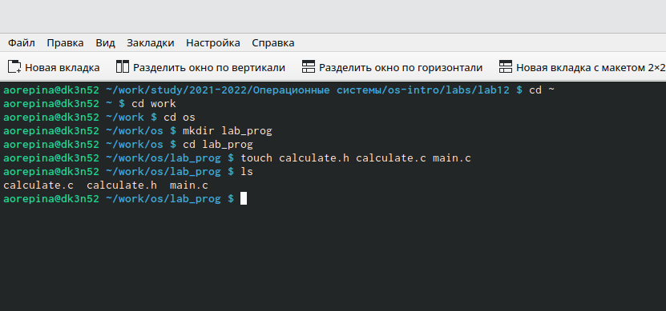
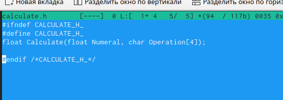
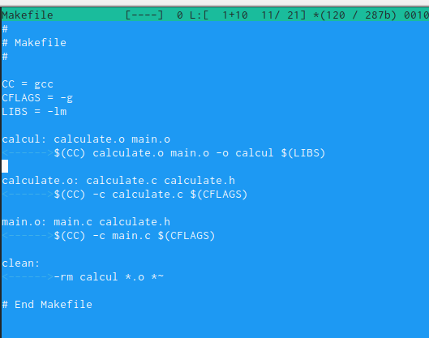
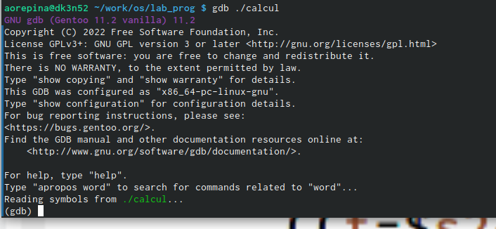

---
## Front matter
lang: ru-RU
title: Лабораторная работа 13
author: Репина Ангелина Олеговна
institute: inst{1}RUDN University, Moscow, Russian Federation
## Formatting
toc: false
slide_level: 2
theme: metropolis
header-includes: 
 - \metroset{progressbar=frametitle,sectionpage=progressbar,numbering=fraction}
 - '\makeatletter'
 - '\beamer@ignorenonframefalse'
 - '\makeatother'
aspectratio: 43
section-titles: true
---

# Создаем необходимые файлы

{ #fig:01 width=70% }

#Программа

Записала текст программы  файлы

{ #fig:01 width=70% }

#Makefile

Создала makefile и с помощью него компилировала необходимые файлы

{ #fig:01 width=70% }

#Отладка

Произвела от ладку

{ #fig:01 width=70% }

# Выводы 

В ходе данной лабораторной работы я приобрела навыки разработки, анализа, тестирования и отладки приложений в ОС на примере создания на языке программирования С калькулятора с простейшими функциями

