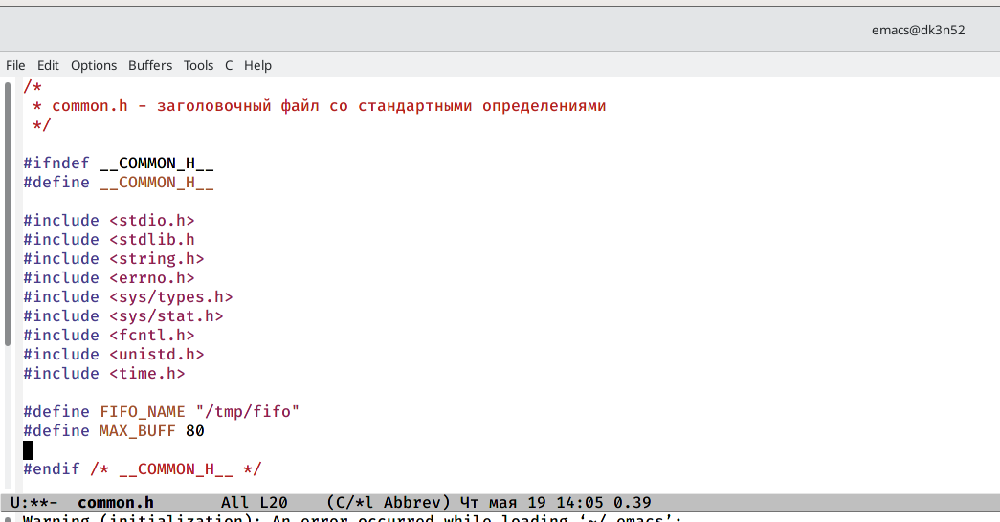
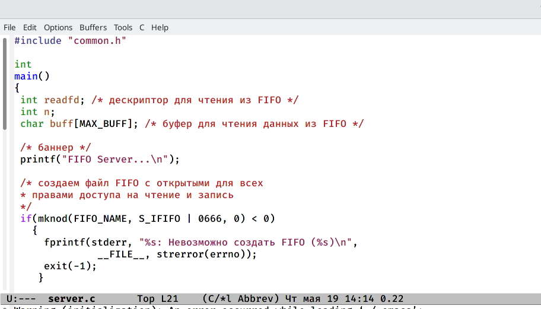
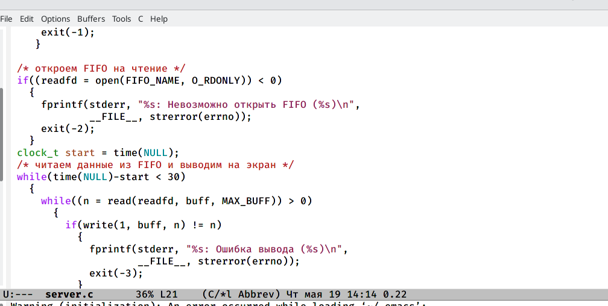
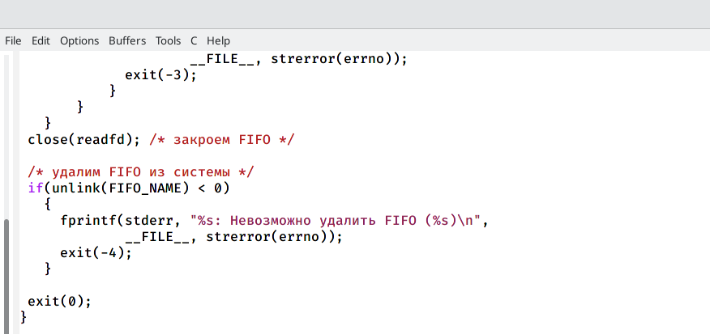
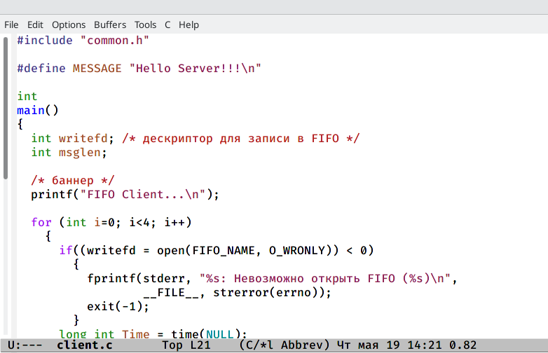
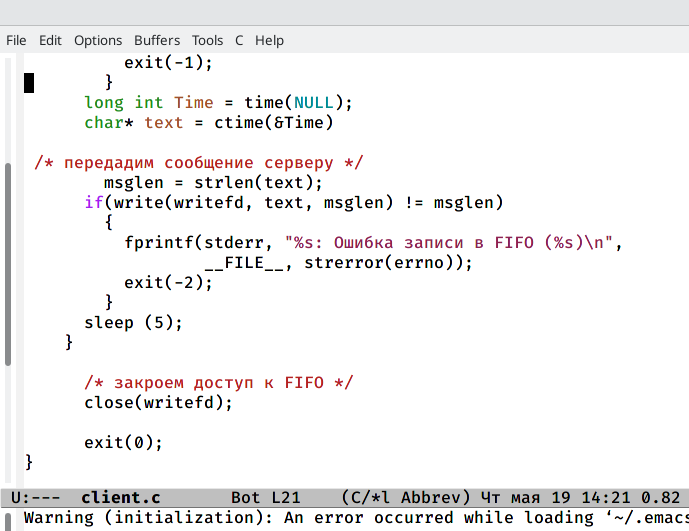
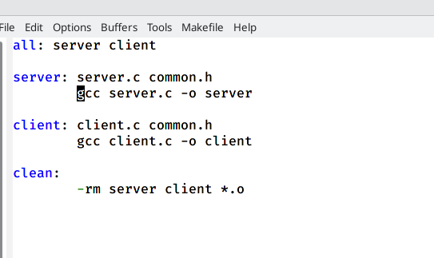
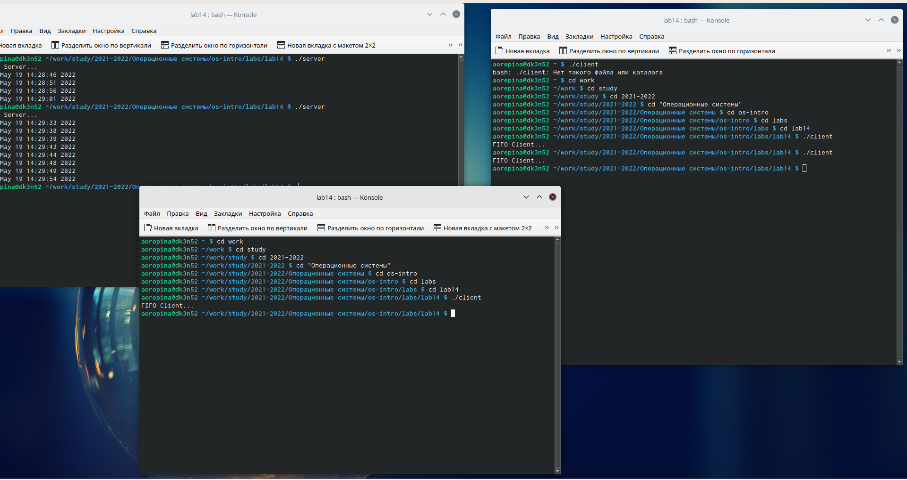

---
## Front matter
lang: ru-RU
title: Лабораторная работа 14
author: Репина Ангелина Олеговна
institute: inst{1}RUDN University, Moscow, Russian Federation

## Formatting
toc: false
slide_level: 2
theme: metropolis
header-includes: 
 - \metroset{progressbar=frametitle,sectionpage=progressbar,numbering=fraction}
 - '\makeatletter'
 - '\beamer@ignorenonframefalse'
 - '\makeatother'
aspectratio: 43
section-titles: true
---

# Цель работы

Цель данной лабораторной работы - приобрести практические навыки работы с именованными каналами

# Файл common.h

{ #fig:01 width=70% }

# Файл server.c

{ #fig:01 width=70% }

{ #fig:01 width=70% }

{ #fig:01 width=70% }

# Файл client.c

{ #fig:01 width=70% }

{ #fig:01 width=70% }

# Makefile

{ #fig:01 width=70% }

# Работа сервера

{ #fig:01 width=70% }

# Выводы

Я приобрела практические навыки по работе с именованными каналами

 
